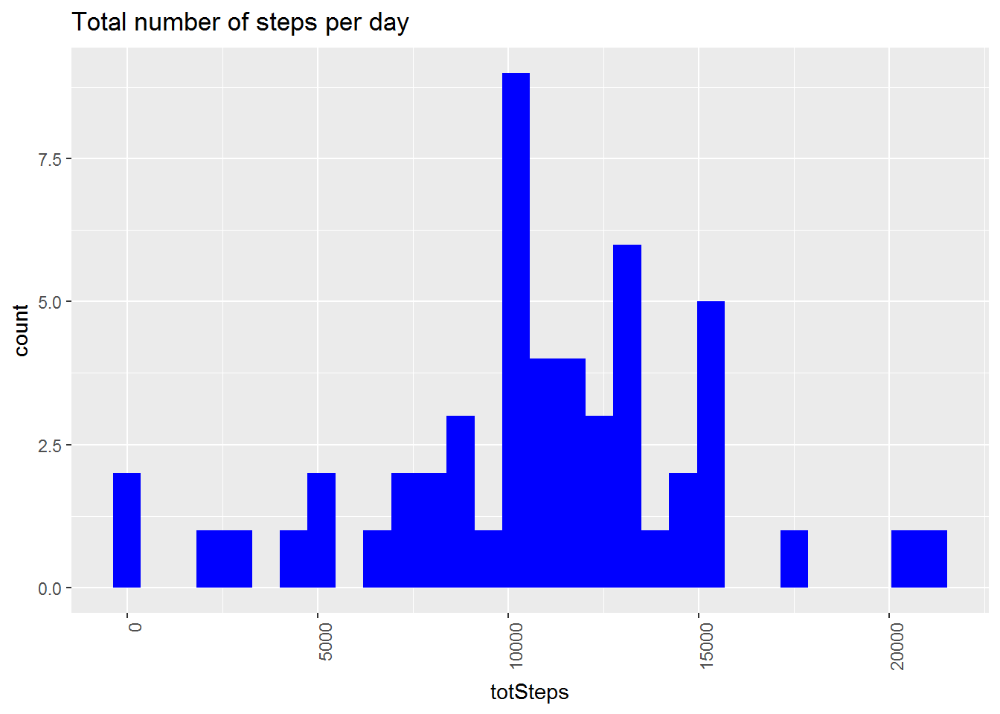
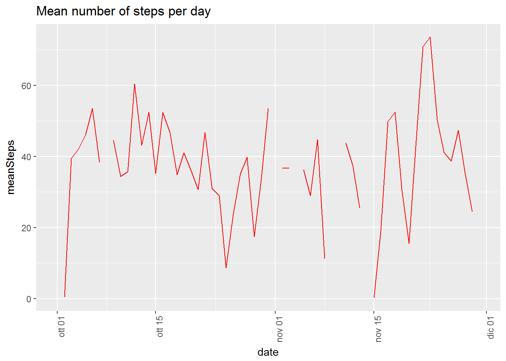
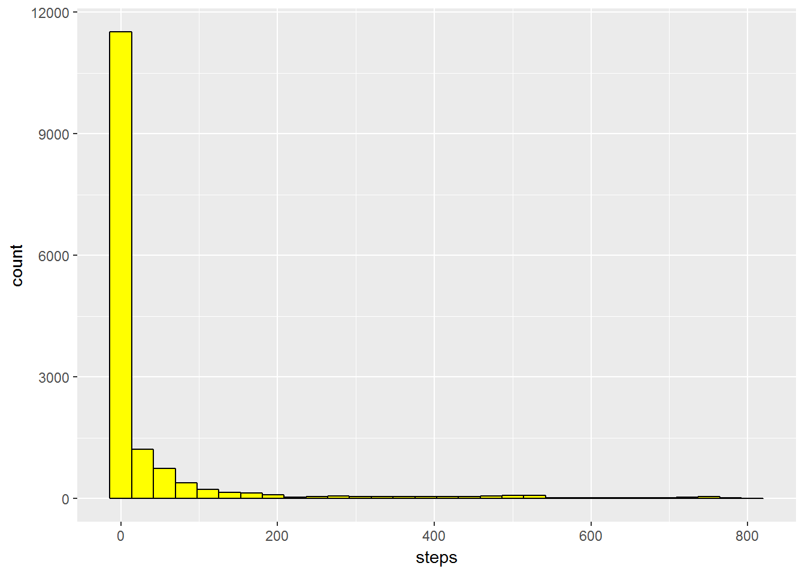
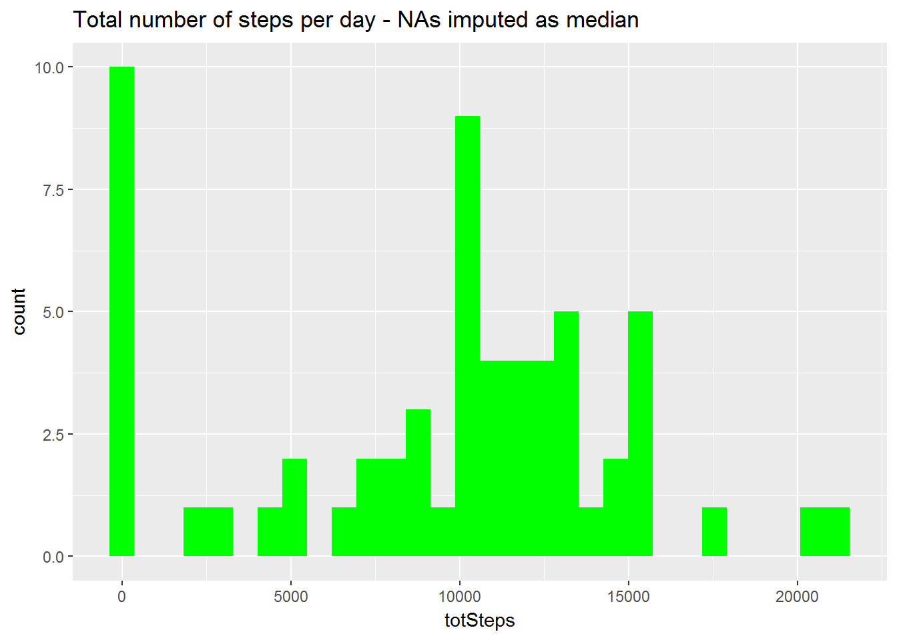
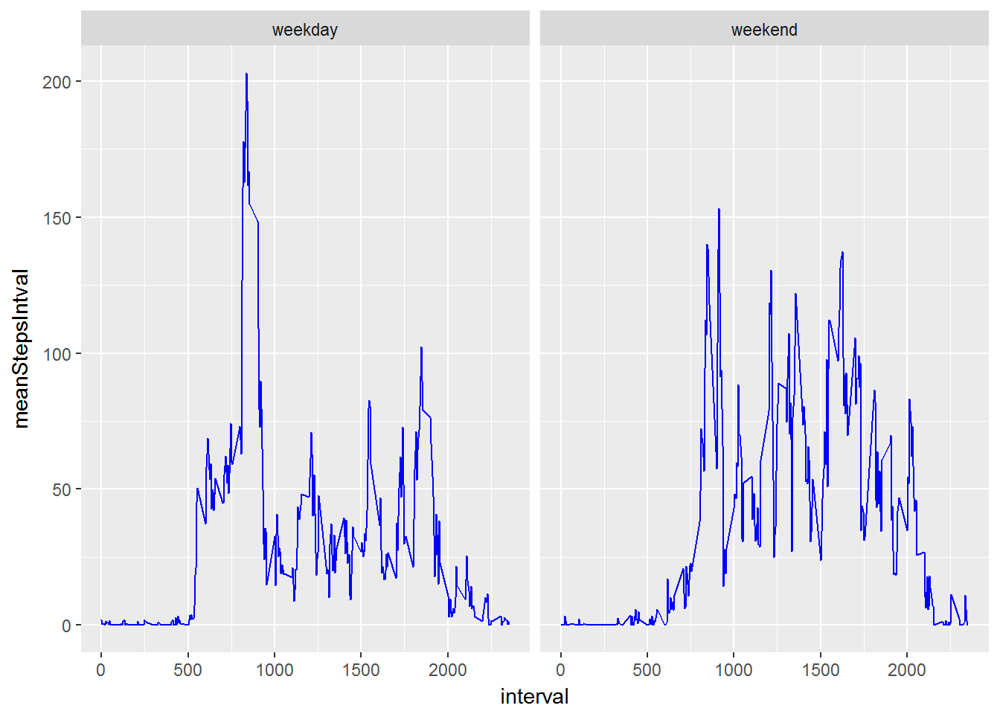

## Introduction
  
This assignment makes use of data from a personal activity monitoring device. 
This device collects data at 5 minute intervals through out the day. 
The data consists of two months of data from an anonymous individual collected during the months of October and November, 2012  
and include the number of steps taken in 5 minute intervals each day.
Aim of the assignment is to load, process and analyse data from the above mentioned device.  
The final question is whether there is a difference in the daily  pattern of activity during weekdays and weekends.
A substantial amount of data, however, is missing and therefore the first part of the assignment consists in assessing the impact of missing data (NAs) 
and of the estimation (imputation) on the relavant parameters.  


## Loading and preprocessing the data

First  of all the two needed libraries (from tidyverse) need to be loaded.  


```r
library(dplyr)
```

```
## Warning: package 'dplyr' was built under R version 3.4.3
```

```
## 
## Attaching package: 'dplyr'
```

```
## The following objects are masked from 'package:stats':
## 
##     filter, lag
```

```
## The following objects are masked from 'package:base':
## 
##     intersect, setdiff, setequal, union
```

```r
library(ggplot2)
```

```
## Warning: package 'ggplot2' was built under R version 3.4.3
```

```
## Need help getting started? Try the cookbook for R:
## http://www.cookbook-r.com/Graphs/
```
  
    
The data is read into the dataframe df from the file named "activity.csv", which should be in the same folder of the .RMD code.  
The column "date" is coerced into a Date type and the structure of the dataframe is then checked.
    
  

```r
df <- read.csv("activity.csv")
df$date <- as.Date(df$date)
str(df)
```

```
## 'data.frame':	17568 obs. of  3 variables:
##  $ steps   : int  NA NA NA NA NA NA NA NA NA NA ...
##  $ date    : Date, format: "2012-10-01" "2012-10-01" ...
##  $ interval: int  0 5 10 15 20 25 30 35 40 45 ...
```

## What is mean total number of steps taken per day?

The dataset (using dplyr functions) is grouped by day and the total number of steps per day is summarized. The first 5 rows of the resulting dataframe (df2) are checked.  
  

```r
df2 <- group_by(df,date) %>%summarize(totSteps = sum(steps))
df2[1:5,]
```

```
## # A tibble: 5 x 2
##   date       totSteps
##   <date>        <int>
## 1 2012-10-01       NA
## 2 2012-10-02      126
## 3 2012-10-03    11352
## 4 2012-10-04    12116
## 5 2012-10-05    13294
```
  
Using ggplot2 function a histogram of the total number of steps per day is generated.
  

```r
p <- ggplot(df2,aes(totSteps))+ geom_histogram(fill="blue") + ggtitle("Total number of steps per day")+
                     theme(axis.text.x = element_text(angle = 90, hjust = 1))
p
```

```
## `stat_bin()` using `bins = 30`. Pick better value with `binwidth`.
```

```
## Warning: Removed 8 rows containing non-finite values (stat_bin).
```


  
Note: from the warning and the missing columns it seems that for 8 days no data is available.
In fact, if we use the mean() and median() functions, the values get coerced to NA.  
  


```r
mean(df2$totSteps)
```

```
## [1] NA
```

```r
median(df2$totSteps)
```

```
## [1] NA
```
  
If we want to have a more meaningful value we must use the parameter na.rm=T, which does not count NAs.
  


```r
mean(df2$totSteps,na.rm=T)
```

```
## [1] 10766.19
```

```r
median(df2$totSteps, na.rm=T)
```

```
## [1] 10765
```
  
Note that the mean and the median appear very similar, but this is a misleading result (see further).   
  
  
  
      
## What is the average daily activity pattern? 
  
The original dataset (df) is grouped by date and summarized by the mean of the steps taken each day. 
To avoid corercion to NA, the na.rm() parameter is applied.
The resulting dataframe (df3)  is checked.


```r
df3 <- group_by(df,date) %>% summarize(meanSteps=mean(steps,na.rm=T))
```

```
## Warning: package 'bindrcpp' was built under R version 3.4.3
```

```r
df3[1:5,]
```

```
## # A tibble: 5 x 2
##   date       meanSteps
##   <date>         <dbl>
## 1 2012-10-01   NaN    
## 2 2012-10-02     0.438
## 3 2012-10-03    39.4  
## 4 2012-10-04    42.1  
## 5 2012-10-05    46.2
```
  
Note that the first line is "NaN" (not  an umber),this  is originated by the fact that all data for day 1 is missing.  
  
  
A time series plot of the mean number of steps per day is originated  
  
  

```r
p2 <- ggplot(df3,aes(x=date, y=meanSteps))+ geom_line(color="red") + 
  ggtitle("Mean number of steps per day") +
  theme(axis.text.x = element_text(angle = 90, hjust = 1))
p2
```

```
## Warning: Removed 2 rows containing missing values (geom_path).
```




The easiest way to find the interval(s) with the highest number of steps would be to sort df into a new dataframe (df4)  in descending order and examine the first rows.


```r
df4 <- arrange(df,desc(steps))
df4[1:5,]
```

```
##   steps       date interval
## 1   806 2012-11-27      615
## 2   802 2012-10-12      900
## 3   794 2012-11-27      550
## 4   789 2012-11-19      720
## 5   786 2012-10-15      835
```
 
 
Another way would be to find the max value in the column and then filter the dataframe for the lines that have that value (in theory, they may be more than one). 
Note that also in this case, for the max() function to give meaningful results we have to take out NAs.  
  
  


```r
maxSteps <- max(df$steps)
maxSteps
```

```
## [1] NA
```

```r
maxSteps <- max(df$steps, na.rm = T)
maxSteps
```

```
## [1] 806
```

```r
filter (df, steps == maxSteps)
```

```
##   steps       date interval
## 1   806 2012-11-27      615
```
  
  
  

##Imputing missing values 


We already know from the previous analyses that there are missing values.  
It is now important to assess how relevant the problem is.

We must now check how many variables have NAs and how many they are.  


```r
sum(is.na(df$interval))
```

```
## [1] 0
```

```r
sum(is.na(df$date))
```

```
## [1] 0
```

```r
sum(is.na(df$steps))
```

```
## [1] 2304
```
  
  
The problem appears to be  limited to the number of steps per interval, but the amount of missing values is very high.  

In order to decide the best strategy, we can first look at the distribution of the variable"steps".  


```r
p3 <- ggplot(df,aes(x=steps)) + geom_histogram(bins=30, fill="yellow", color="black") 
p3
```

```
## Warning: Removed 2304 rows containing non-finite values (stat_bin).
```



If we do not consider missing values, the most frequent value per interval seems to be 0.  

The distribution, therefore,seems highly skewed to the left.  

This is confirmed also by the calculation of the  mean (without NAs), the median (without NAs) and the mode, i.e.the most frequent value. 


```r
mean(df$steps, na.rm=T)
```

```
## [1] 37.3826
```

```r
median(df$steps, na.rm=T)
```

```
## [1] 0
```

```r
t <- table(df$steps)
mode <- t[t==max(t)]
mode
```

```
##     0 
## 11014
```
  
  
Since the distribution is not normal, a possible solution could be to impute NAs as the median of the remaining available values. In this case this is also the most frequent value.  
The dataframe df5 corresponds to the original dataframe with all NAs changed to the median.


```r
df5 <- df
df5$steps[is.na(df5$steps)] <- median(df$steps, na.rm=T)
df5[1:5,]
```

```
##   steps       date interval
## 1     0 2012-10-01        0
## 2     0 2012-10-01        5
## 3     0 2012-10-01       10
## 4     0 2012-10-01       15
## 5     0 2012-10-01       20
```

We can now create another dataframe (df6) with the intervals grouped by date an summarized by the total number of steps per day.  


```r
df6 <- group_by(df5,date) %>%summarize(totSteps = sum(steps))

p4 <- ggplot(df6,aes(totSteps))+ geom_histogram(fill="green") + ggtitle("Total number of steps per day - NAs imputed as median")
p4
```

```
## `stat_bin()` using `bins = 30`. Pick better value with `binwidth`.
```


  
  
Then we can calculate the new mean (newMean) and median(newMedian) of steps taken per day.
  


```r
newMean <- mean(df6$totSteps)
newMean
```

```
## [1] 9354.23
```

```r
newMedian <- median(df6$totSteps)
newMedian
```

```
## [1] 10395
```


and compare it to the previous values obtained with na.rm (oldMean and oldMedian) and already calculated previously.  


```r
oldMean<- mean(df2$totSteps,na.rm=T)
oldMean
```

```
## [1] 10766.19
```

```r
oldMedian <- median(df2$totSteps, na.rm=T)
oldMedian
```

```
## [1] 10765
```
  
if we compare the distributions of the 4 parametrs using the summary() function we can easily see that, after imputing NAs as the value of the mode/median, the mean has decreased of approximately 10%, while the median has changed very little.
  

  
##Are there differences in activity patterns between weekdays and weekends? 

To answer this question we can create a new dataset (df7) starting from df5 (i.e. df with NAs imputed) using the mutate function from dplyr and the function weekdays(), which gives for each date the corresponding day of the week, stored in column dayOfWeek.  
  

```r
df7 <- mutate(df5, dayOfWeek=weekdays(date))# 
df7[5:10,]
```

```
##    steps       date interval dayOfWeek
## 5      0 2012-10-01       20    lunedì
## 6      0 2012-10-01       25    lunedì
## 7      0 2012-10-01       30    lunedì
## 8      0 2012-10-01       35    lunedì
## 9      0 2012-10-01       40    lunedì
## 10     0 2012-10-01       45    lunedì
```
    
If we apply a joint MUTATE/IF ELSE function to dayOfWeek, we obtain a new dataset (df8) with an additional column(typeOfDay) containing  a categorical variable that can assume two values:  "weekday" or "weekend".  
  


```r
df8 <- mutate(df7, typeOfDay = ifelse(dayOfWeek =="sabato" | dayOfWeek == "domenica","weekend","weekday"))

df8[4030:4035,]
```

```
##      steps       date interval dayOfWeek typeOfDay
## 4030     0 2012-10-14     2345  domenica   weekend
## 4031     0 2012-10-14     2350  domenica   weekend
## 4032     0 2012-10-14     2355  domenica   weekend
## 4033     0 2012-10-15        0    lunedì   weekday
## 4034     0 2012-10-15        5    lunedì   weekday
## 4035     0 2012-10-15       10    lunedì   weekday
```

If we want to separate the activity data from weekends to weekdays we can group df8 by interval and then summarize using the mean number of steps.  


```r
df9 <- group_by(df8, typeOfDay, interval) %>% summarize(meanStepsIntval=mean(steps))

df9[500:505,]
```

```
## # A tibble: 6 x 3
## # Groups: typeOfDay [1]
##   typeOfDay interval meanStepsIntval
##   <chr>        <int>           <dbl>
## 1 weekend       1735            34.9
## 2 weekend       1740            43.8
## 3 weekend       1745            41.5
## 4 weekend       1750            31.2
## 5 weekend       1755            32.4
## 6 weekend       1800            75.1
```

Finally, a direct comparison of the two activity patterns can be obtained by plotting the two time series (interval vs meanStepsIntval) side by side using the facet_grid() option of ggplot2.


```r
p5 <- ggplot(df9, aes(x=interval, y=meanStepsIntval)) + geom_line(color="blue") +
      facet_grid(. ~ typeOfDay) 

p5
```



